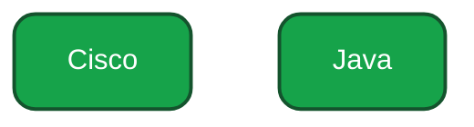

# Database test folder

This the help of databases for diffrents command line and usign for the first database that i used.

## Author: Mohammad Reza Heydari

## DEVOPS 2025

## Link

```mermaid
graph TD
A[Cisco]
click A "Cisco/README.md"

B[Java]
click B "Java/README.md"

classDef button fill:#16a34a,color:#ffffff,stroke:#14532d,stroke-width:2px, ry:12, rx:12;

class A button;
class B button;
```
